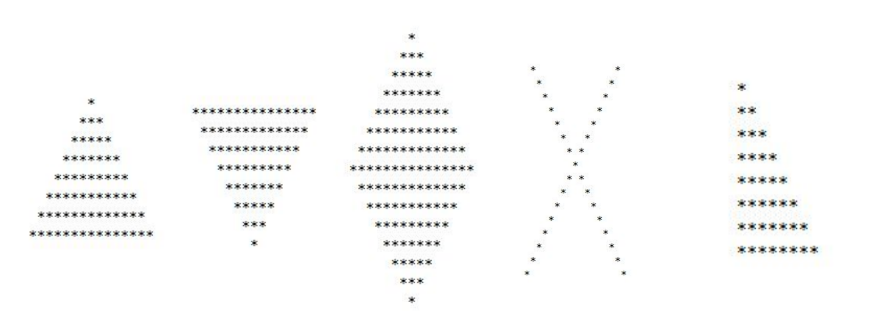

### Dibuat oleh Riki Abdilah - Universitas Yarsi
#### Cara menjalankan:
Jalankan file melalui App.kt pada package view

#### Spesifikasi soal: 
    1. Menerapkan bahasa pemrograman Kotlin (30 poin)
    2. Menerapkan control flow (20 poin)
    3. Menerapkan function & method untuk masing-masing task (20 poin)
    4. Menerapkan setidaknya 2 konsep OOP dalam membuat bentuk (20 poin) 
    5. Menerapkan setidaknya 1 ciri SOLID principle (10 poin)


#### Keterangan: 
    1. package model berisi Class serta Interface
    2. package view berisi fungsi main untuk menjalankan program

#### Directory file:
```
ChallengeTopic1/src/main/kotlin
```